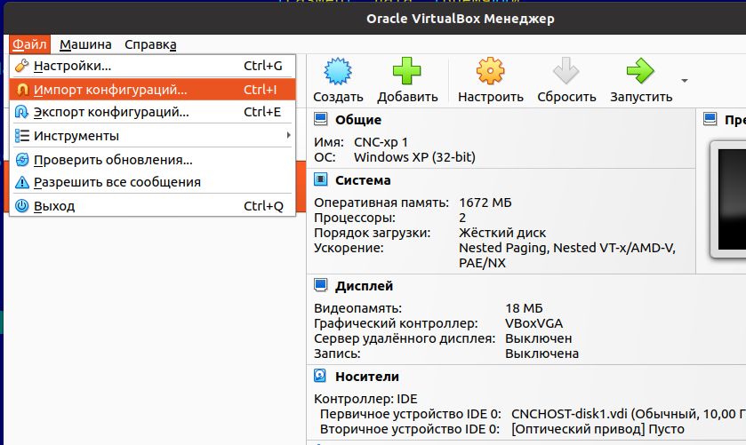
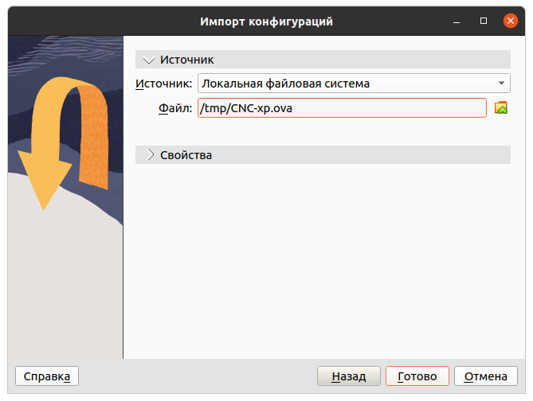
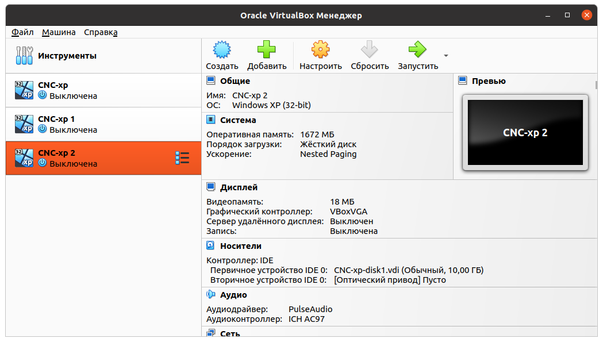
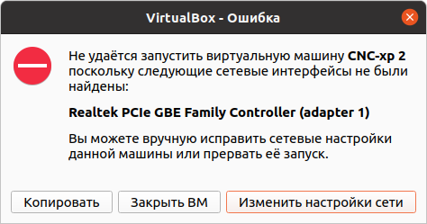
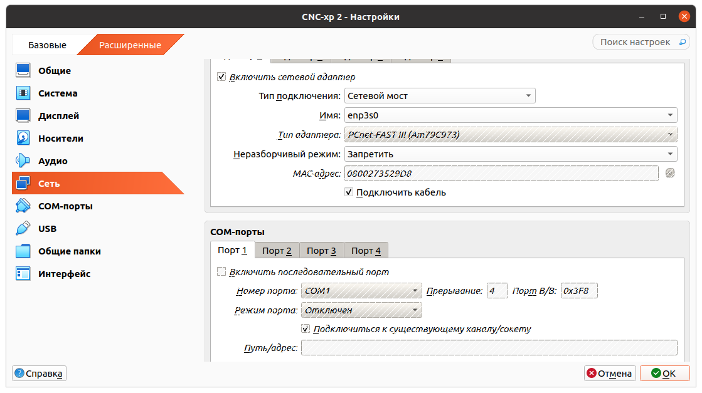
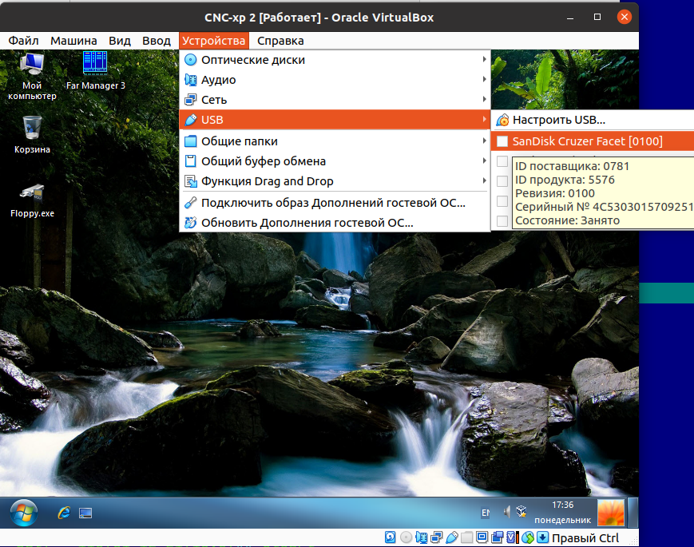

# Использование утилиты FLOPPY.EXE в виртуальной машине

1. Установите [VirtualBox](https://www.oracle.com/virtualization/virtualbox/)
 под вашу платформу.

2. Скачайте [образ](https://cloud.mail.ru/public/K5BL/mFvvqqUg2) виртуальной машины.

3. Выполните импорт виртуальной машины в систему
   
   , выбрав скаченный образ
   .

4. Запустите импортированную виртуальную машину  
   
   , скорее всего будет ошибка  
   
   , нажмите ```Изменить настройки сети```
   
   и повторите запуск.

5. После запуска системы подключите флешку и передайте её под управление виртуальной машины
   
   (нужному устройству поставьте "галочку")

После вышеописанных действий можно использовать утилиту FLOPPY.EXE