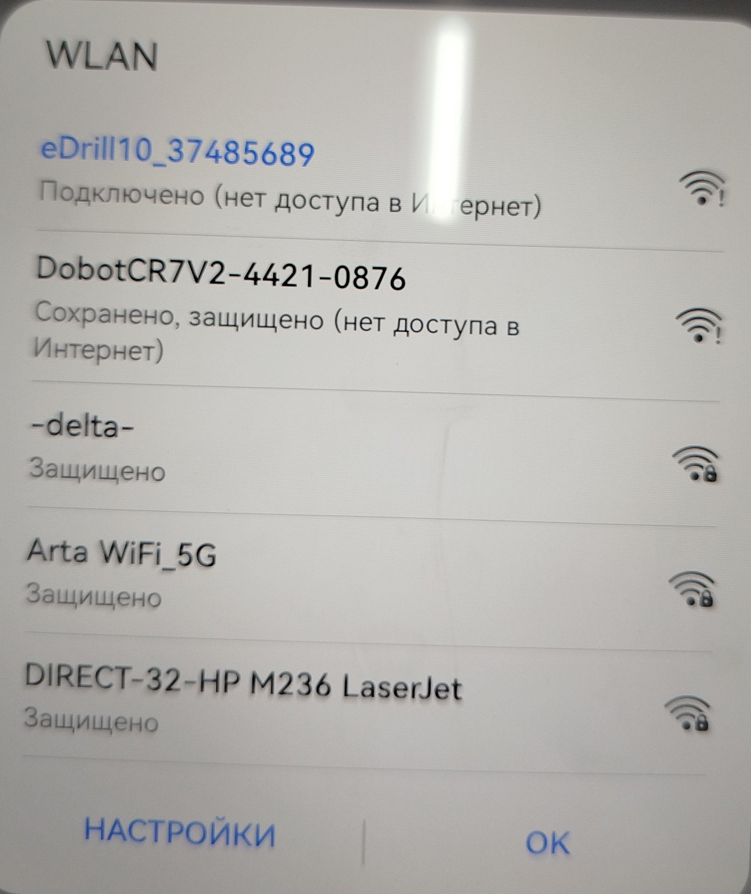
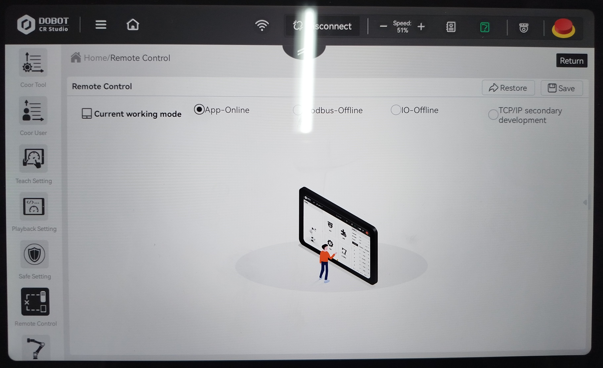
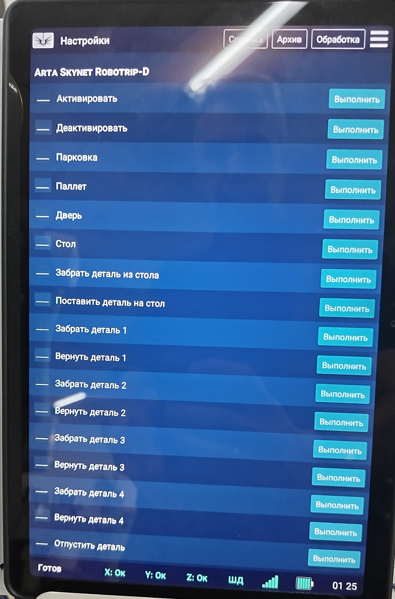
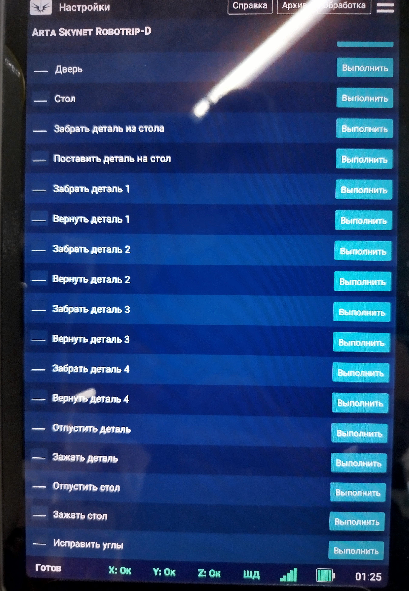
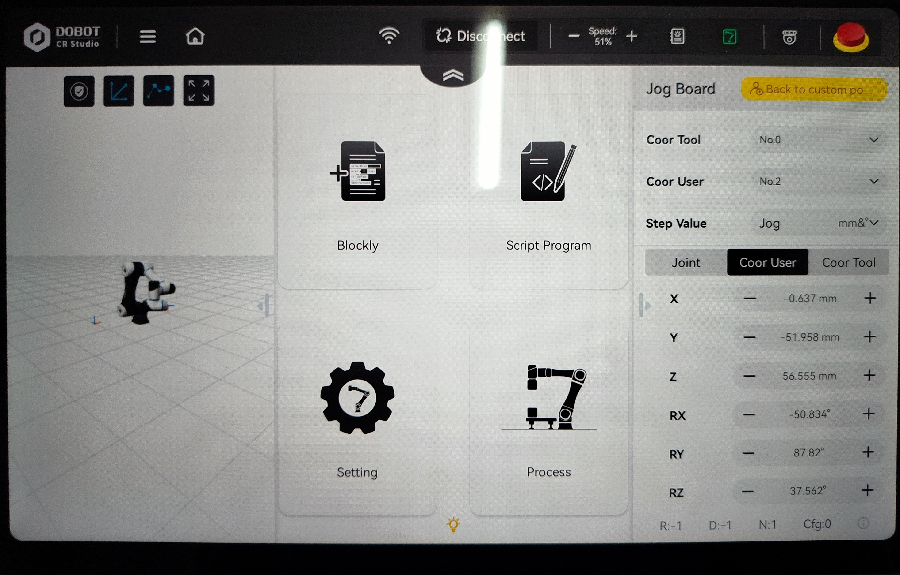
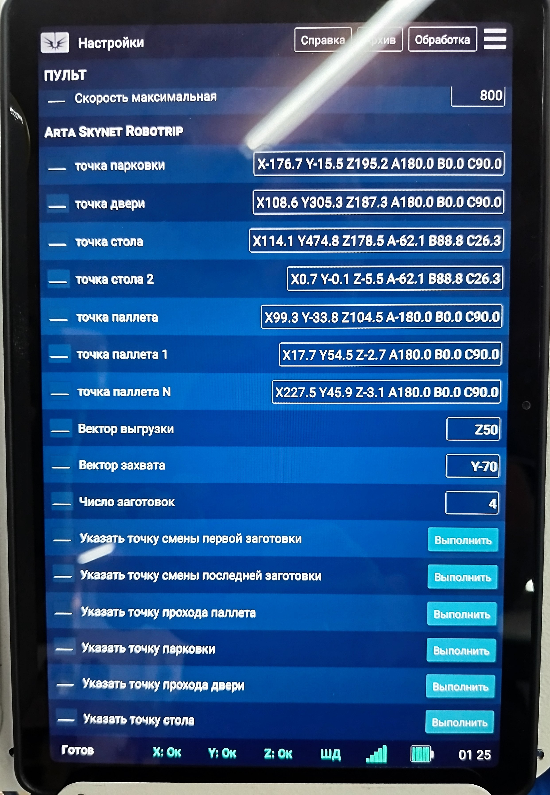

# Руководство по работе с манипулятором Dobot в составе eDrill-10

## Подключение

 Подключить питание и подключить патчкорд к роутеру станка в свободный оранжевый разъём.  
 Включить станок и робота.  
 Подключить планшет к сети станка (eDrill10 ...).  

   
 Запустить ```Dobot RC Studio``` и подключиться к манипулятору.


## Режимы работы робота

 С помошью планшета можно переключать права управления между планшетом и eDrill10.  
 Переключение выполняется на экране ```Settings->Remote Control```  
   
 
 - ```App-Online```        = Управление с планшета  
 - ```TCP/IP secondary```  = Управление от eDrill10  

 После переключения нужно нажать кнопку ```Save``` и дождаться подтверждения.

 ***После переключения управления на eDrill10 необходимо сделать реинициализацию манипулятора:***  

 - Деактивировать манипулятор 
 - Активировать манипулятор
 - Дождаться зелёной индикации на панеле управления
 

## Выход в рабочее положение

 После установки манипулятора на опору в транспортном состоянии следует развернуть его в одну линию
 через планшет. После переключиться в режим управления с планшета и повернуть ```J1,J2,J3``` 
 в близкие к рабочим положения (к сожалению не осталось сведений о координатах).
 После можно переключать манипулятор в режим управления от eDrill10 и выполнить переход в положение ```ПАРКОВКА```

## Проверка исправности пневматической системы

 Для нормального функционирования требуется исправная пневмосистема. Для проверки используются команды:  
 
 1\. Отпустить деталь (манипулятор)  
 2\. Зажать деталь    (манипулятор)  
 3\. Отпустить стол   (рабочий стол)  
 4\. Зажать стол      (рабочий стол)  
 

 Все эти команды должны выполнятся.

## Настройка положений манипулятора

 Манипулятор используется для перемещения заготовки между паллетом и рабочей зоной. Выделены следующие базовые положения:  
 
 1\. ПАРКОВКА - место не мешающее действиям оператора и станка  
 2\. ПАЛЛЕТ   - место над паллетом из которого выполняется захват и возврат заготовок  
 3\. ДВЕРЬ    - место прохода двери станка  
 4\. СТОЛ     - место над рабочим столом из которого выполняется захват и возврат заготовок  
 
 Для удобства в манипуляторе настроены две декартовы системы координат:  

 1\. Координаты паллета (ПАРКОВКА,ПАЛЛЕТ,ДВЕРЬ)  
 2\. Координаты зоны обработки (СТОЛ)  

 Для настройки базовых точек (ПАРКОВКА,ПАЛЛЕТ,ДВЕРЬ) нужно переключить управление на планшет, 
 выбрать соответствующую систему координат ```Coor User 1``` переместиться в желаемое положение (```X,Y,Z```).  
   
 Переключить управление на eDrill10 (можно не активировать) и выполнить установку точки (Указать точку ...).  
   
 Вернуть управление на планшет и повторить операцию для остальных точек.  

 После настройки переключить управление на eDrill10 (с активацией) и проверить перемещение между точками. Перемещение 
 выполняется последовательно по цепочке ```ПАРКОВКА``` - ```ПАЛЛЕТ``` - ```ДВЕРЬ``` - ```СТОЛ```  

## Настройка точек захвата из паллета

 Захват выполняется с фронтальной стороны паллета, манипулятор отступает на ```вектор захвата паллета``` и переходит в точку захвата.
 Затем переходит на ```вектор выгрузки паллета``` и по прямой в точку паллета.

 Нужно указать 2 крайние точки (первую и четвёртую).  
 Процедура установки точки:  

 - выходим в точку паллета
 - разжимаем захват
 - переключаем управление на планшет
 - выходим в точку захвата через перемещения планшета (СК User1)
 - переключаем управление на eDrill10 (можно не активировать)
 - указываем соответствующую точку
 - переключаем управление на планшет
 - отходим в безопасное положение

 Повторяем процедуру для последней точки.

 После настройки переключить управление на eDrill10 (с активацией) 
 и проверить процедуру захвата и возврата детали в паллет 
 на всех точках сначала без детали и потом с деталью.

## Настройка точки рабочего стола

 Захват выполняется с верхней стороны стола, манипулятор опускается на ```вектор захвата стола``` и переходит в точку стола.
 Затем переходит на ```Вектор выгрузки стола``` и по прямой в точку рядом со столом.  
 Для настройки нужно переключить управление координаты ```Y``` 
 на поворотный стол (если на горячую, то нужно перезагружать eDrill10 для избежания сбоя ШД).
 Выставить направляющие стола в положение ```(+)```, фитинг на 1ч30м, сбросить координату ```Y```.


 Для задания точки:

 - выходим в точку стола (от предидущих настроек)
 - разжимаем захват
 - переключаем управление на планшет
 - переключаемся в ```Coor User 2```
 - выходим фактическую в точку на столе (захват вниз, середина губок посередине слота, можно ниточку привязать с узелком посередине)
 - переключаем управление на eDrill10 (можно не активировать)
 - указываем точку стола
 - переключаем управление на планшет
 - отходим в безопасное положение

 После настройки переключить управление на eDrill10 (с активацией) 
 и проверить процедуру захвата и возврата детали на стол 
 без детали и потом с деталью которую взяли из паллета.

## Финальная комплексная проверка работы манипулятора

 Паркуем робота. Устанавливаем все заготовки на паллет.
 Выбираем программу из локального диска ```EXPO26/robot0.lua```.
 Запускаем на исполнение.  
 Программа будет выставлять все заготовки по очереди, поворачивать их в поворотном столе на 45 и обратно.

## Финальная настройка положения ```XY```

 - устанавливаем заготовку на стол
 - поворачиваем стол на 45 (с планшета 45\*2.5=112.5 или программа ```EXPO26/Rotor+45.lua```)
 - переключаем координату на ```Y```
 - совмещаем электрод с отверстием правой детали
 - сбрасываем ```XZ```
 - отключаем ```Y```
 - возвращаем ```Y``` в положение 45\*2.5=112.5
 - переключаем управление на поворотный стол с перезагрузкой
 - возвращаем поворотный стол в 0
 - отводим ```X``` на 100 вправо (или на число указанное в программе ```EXPO26/task1.lua```->```local oX=100 -- расстояние парковки```)

## Программа на выставку

 Выбираем программу из локального диска ```EXPO26/robot4.lua```.  
 Запускаем на исполнение.  
 Программа будет выставлять все заготовки по очереди, имитировать их обработку и ставить обратно.  
