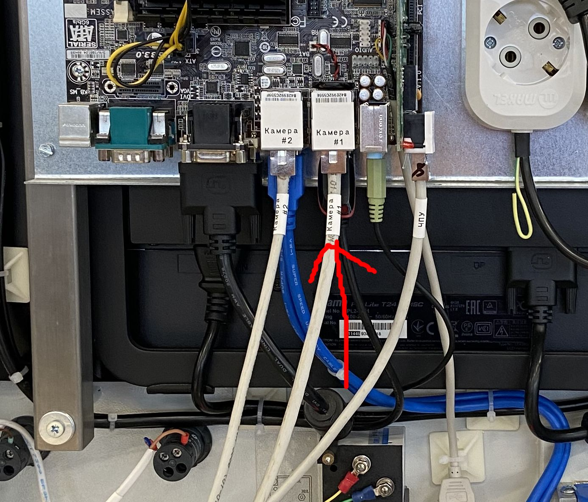
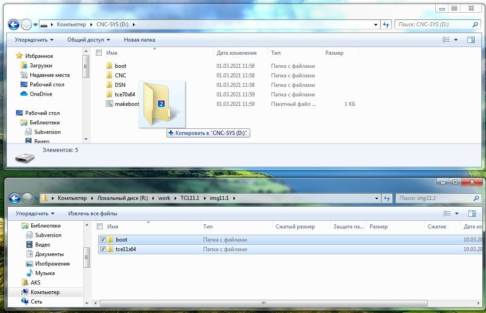
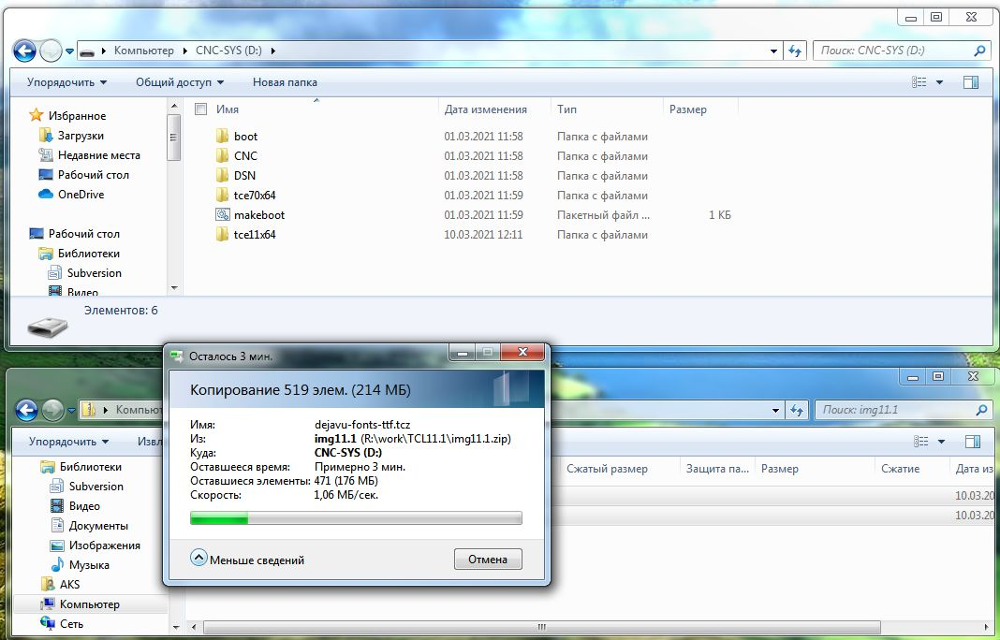
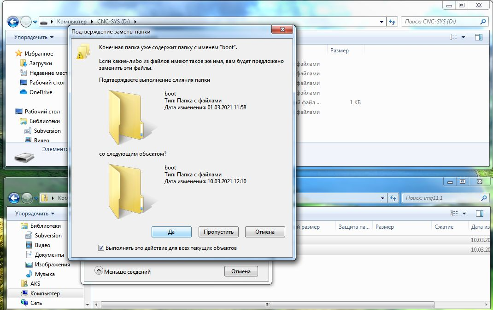
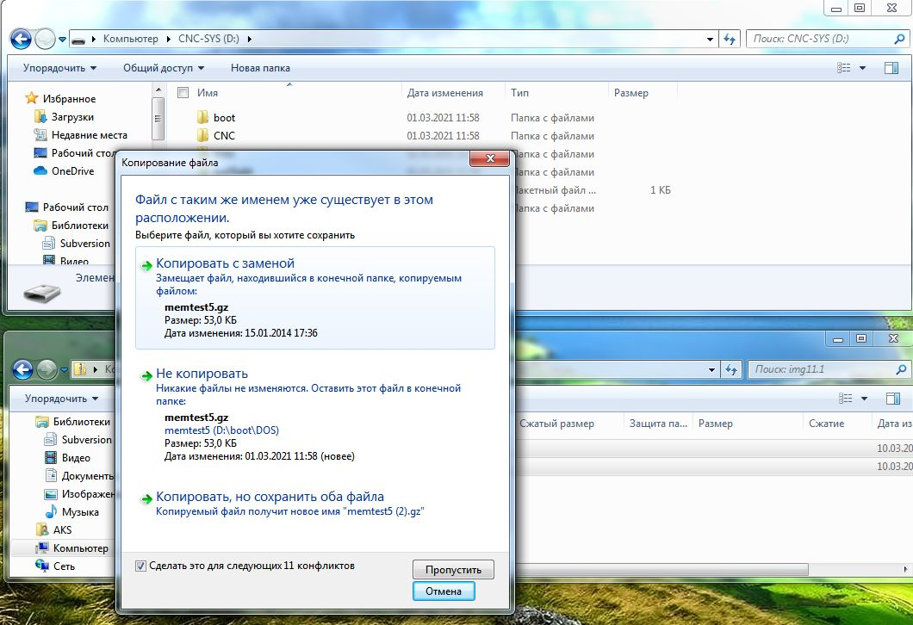
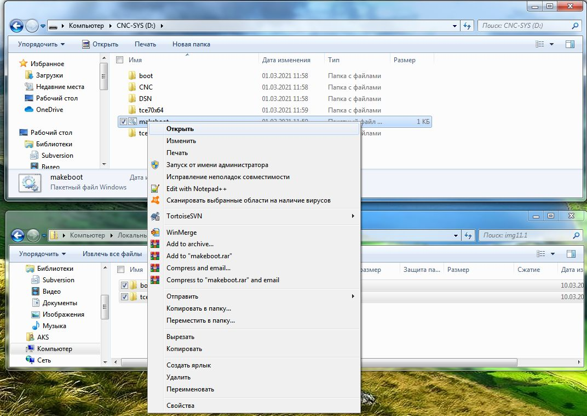
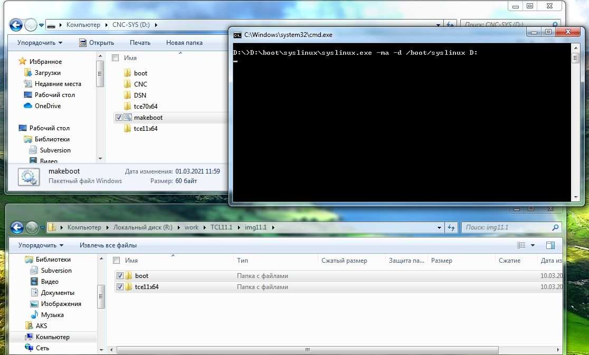

1. отключить станок  
2. открыть заднюю крышку терминала   
3. достать системную флешку и подключить её к рабочему компьютеру (WIN)  
4. [скачать 11 версию] ОС (https://cloud.mail.ru/public/4cvq/ncNqFnYBe)  
5. открыть в одном окне проводника флешку (первый раздел), верхний на скриншотах  
6. во втором окне проводника открыть скачанный архив, нижний на скриншотах  
7. переместить содержимое архива в корень флешки (папка ```boot``` будет заменена)  
8. при копировании соглашаться на замену файлов  
9. после копирвания открыть(запустить) файл ```makeboot.bat```  
10. безопасно извлеките флешу и верните на место в СЧПУ.  

*   
*   
*   
*   
*   
*   
*   
