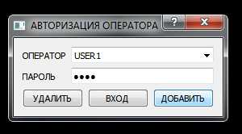
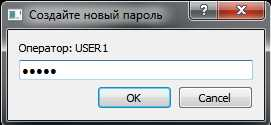
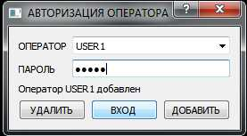
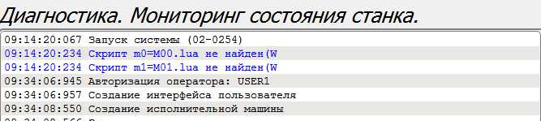

# СЧПУ АРТА.X-10. Ограничение доступа

## Активация функции ограничения доступа
Для активации используйте управляющую программу `initpsw.lua`.
Загрузите её и выполните. При удачном завершении процедуры появится сообщение
`Ограничение доступа активировано`. После этого нужно перезапустить систему `SHIFT+ESC`.

## Создание учётной записи администратора 
После активации функции ограничения доступа нужно задать `АДМИНИСТРАТОРА СЧПУ`  
  
В поле `ОПЕРАТОР` задайте имя администратора, в поле `ПАРОЛЬ` пароль и нажмите кнопку `ДОБАВИТЬ`

## Создание учётной записи оператора
Когда учётная запись администратора создана, можно добавить учётную запись оператора.  
  
В поле `ОПЕРАТОР` задайте имя оператора, в поле `ПАРОЛЬ` указываем пароль `!! АДМИНИСТРАТОРА !!` и 
нажимаем кнопку `ДОБАВИТЬ`  
  
В появившемся окне введите пароль для нового оператора.

## Вход в систему
После создания учётной записи оператора, выбираем её из списка, вводим пароль и нажимаем кнопку `ВХОД`  
  
Во время входа в журнале создаётся запись.  
  

## Удаление учётной записи
Выберите нужную учётную запись, введите пароль администратора, нажмите на кнопку `УДАЛИТЬ` 
и согласитесь на совершение операции.

## Деактивация функции ограничения доступа
Для деактивации используйте управляющую программу `killpsw.lua`.
Загрузите её и выполните. При удачном завершении процедуры появится сообщение
`Ограничение доступа отключено`.

