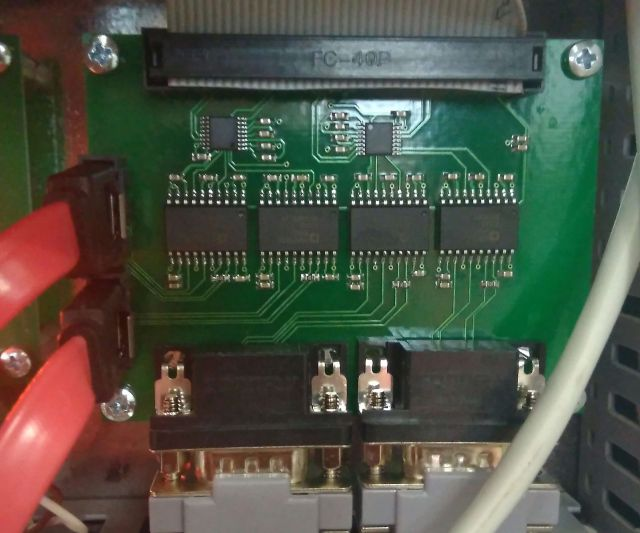
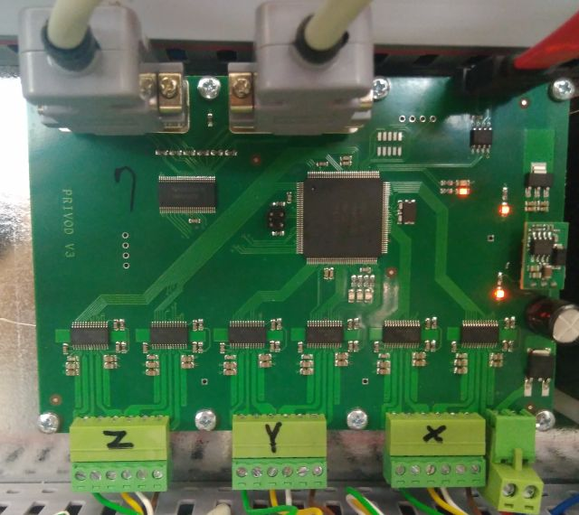

# СЧПУ АРТА.X-10. Подсистемы реального времени (RCNC)

Подсистема выполняет обслуживание устройств требовательных к времени реакции (управление двигателями, каналы связи и входы/выходы). 
Подсистема связана с управляющей частью через канал Eternet100M.
Подсистема реализована на промышленном модульном компьютере на базе материнской платы IOWA-GX466 и нескольких плат расширения.
Было выпущено 7 исполнений, в зависимости от требований и доступности оборудования

## Описание вариантов подсистемы реального времени

| ВАРИАНТ    |   ПО                                  | ВХОДЫ/ВЫХОДЫ      | ГЕНЕРАТОР  | ПЕРЕМОТКА | ПУЛЬТ ДУ. | SDRV        |
|------------|---------------------------------------|-------------------|------------|-----------|-----------|-------------|
| MOXA       | [V3.16](RCNC/MOXA/lancnc316.zip),[V3.15](RCNC/MOXA/lancnc315.zip),[V3.10](RCNC/MOXA/lancnc310.zip),[V3.8](RCNC/MOXA/lancnc38.zip) | PCL730(1,2)       | MOXA.3     | MOXA.4    | IOWA.COM3 | MOXA.1-2    |
| MOXA0      | [V3.16](RCNC/MOXA0/lancnc316.zip),[V3.15](RCNC/MOXA0/lancnc315.zip),[V3.10](RCNC/MOXA0/lancnc310.zip),[V3.8](RCNC/MOXA0/lancnc38.zip) | PCL730(1,2)       | MOXA.3     | НЕТ       | MOXA.4    | MOXA.1-2    |
| MOXA00     | [V3.16](RCNC/MOXA00/lancnc316.zip),[V3.15](RCNC/MOXA00/lancnc315.zip),[V3.10](RCNC/MOXA00/lancnc310.zip),[V3.8](RCNC/MOXA00/lancnc38.zip) | PCL730(1,2)       | MOXA.3     | MOXA.2,4 | IOWA.COM3 | MOXA.1    |
| MOXA1      | [V3.16](RCNC/MOXA1/lancnc316.zip),[V3.15](RCNC/MOXA1/lancnc315.zip),[V3.10](RCNC/MOXA1/lancnc310.zip),[V3.8](RCNC/MOXA1/lancnc38.zip) | PCL730(1,2)       | IOWA.COM2  | IOWA.COM1 | IOWA.COM3 | MOXA.1-2    |
| PCL730_3   | [V3.16](RCNC/PCL730_3/lancnc316.zip),[V3.15](RCNC/PCL730_3/lancnc315.zip),[V3.10](RCNC/PCL730_3/lancnc310.zip),[V3.8](RCNC/PCL730_3/lancnc38.zip) | PCL730(1,2,3)     | IOWA.COM2  | IOWA.COM1 | IOWA.COM3 | НЕТ         |
| PCL745     | [V3.16](RCNC/PCL745/lancnc316.zip),[V3.15](RCNC/PCL745/lancnc315.zip),[V3.10](RCNC/PCL745/lancnc310.zip),[V3.8](RCNC/PCL745/lancnc38.zip) | PCL730(1,2)       | PCL745.2   | PCL745.1  | IOWA.COM3 | НЕТ         |
| PCL745_SER | [V3.16](RCNC/PCL745_SER/lancnc316.zip),[V3.15](RCNC/PCL745_SER/lancnc315.zip),[V3.10](RCNC/PCL745_SER/lancnc310.zip),[V3.8](RCNC/PCL745_SER/lancnc38.zip) | PCL730(1,2)       | IOWA.COM2  | IOWA.COM1 | IOWA.COM3 | PCL745.1-2  |
| PCL849     | [V3.17](RCNC/PCL849/lancnc317.zip),[V3.16](RCNC/PCL849/lancnc316.zip),[V3.15](RCNC/PCL849/lancnc315.zip),[V3.13](RCNC/PCL849/lancnc313.zip),[V3.10](RCNC/PCL849/lancnc310.zip),[V3.9](RCNC/PCL849/lancnc39.zip) | PCL730(1,2)       | PCL849.3   | PCL849.4  | IOWA.COM3 | PCL849.1-2  |

## Как определить какой вариант установлен?
1. Открыть шкаф СЧПУ (крепится 4 винтами)
2. Если виден разветвитель **чёрного цвета DB37-DB9x4** значит выбираем из вариантов **MOXA** (2015-2017г)
	1. если на станке нет перемотки проволоки и вращения электрода, то вариант **MOXA0**.
	2. если разъёмы с разветвителя с номерами 3 и 4 используются, то вариант **MOXA**.
	3. иначе **MOXA1**.
	4. если в станке вторая плата перемотки управляет шпинделем **MOXA00**.
3. Если установлено 3 одинаковые платы PCL730 или ISO-730, то вариант **PCL730_3** (редкий).
4. Если установлена плата , то вариант **PCL849** (2017-2019г).
5. Если используются платы управления шаговыми двигателями формата SDRV (подключаются через SATA кабель) , 
   то вариант **PCL745_SER**, иначе **PCL745**.

## Обновление ПО системы реального времени.
1. Подготовка: На USB-Flash отформатированный в FAT-32 нужно записать 2 файла:
	1. исполняемый файл из таблицы, **извлечь из архива!**
	2. командный [файл](CMD/update.bat)
	* В корне диска должны быть 2 файла **update.bat** и **lancnc.exe**, допускается наличие любых других файлов.
2. Установка: В **выключенный** станок подключить USB-Flash в разъём рядом с материнской платой IOWA. Для этого нужно открыть 
   крышку шкафа СЧПУ.
3. Включить станок и дождаться загрузки СЧПУ.
4. Извлечь USB-Flash.

## Альтернативный путь, при наличии адаптера для CF-карт.
1. Достать диск и подключить его к компьютеру через адаптер.
2. Заменить файл CNC/lancnc.exe на новую версию.
3. Вернуть диск обратно.

## История изменений.
* 3.17 Исправлены ошибки настройки ШД.
* 3.16 Включена опция "ПОКАДРОВАЯ" обработка.
* 3.15 Исправлена ошибка обработки очереди программных последовательностей.
* 3.13 Добавлен механизм форсирования выходов для противодействию помех.
* 3.10 Скорректированы скорости движения по UV (для x54 систем)
* 3.9 Шпиндель игнорирует кадры паузы (Pxxx)
* 3.8 Поддержка шпиндельной координаты
* 3.7 Поддержка отключения питания после остановки системы.
* 3.6 Ограничение скорости неускоренного движения. 
* 3.4 Повышение устойчивости к помехам.
* 3.3 Исправлена ошибка приводящая к сбою при откате после восстановления задачи.
* 3.2 Изменения в работе гидросистемы.
* 3.1 Добавлена функция установки станочной координаты в заданное значение
* 3.0 Базовая версия.

