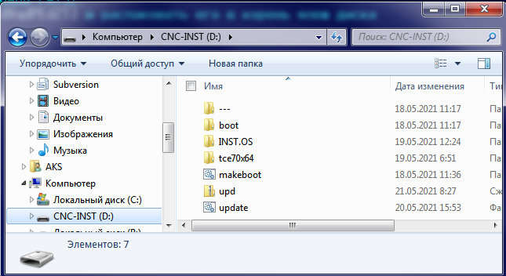

# Инсталяция ARTAOS на СЧПУ АРТА

ARTAOS представляет собой LIVE сборку на базе Debian 10(Buster) с необходимым для работы СЧПУ АРТА набором пакетов.  

## Базовые возможности

Для инсталляции изготовлена утилита позволяющая: 

1. Установить ARTAOS 
2. Сохранить текущую установку TC7
3. Восстановить сохранённую установку TC7

## Процедура установки

Для установки понадобиться USB-флеш диск с файловой системой FAT32, это будет установочный диск.

Нужно: 
1. скачать [архив](https://cloud.mail.ru/public/7f1u/dVqdPEdZT) и распаковать его в корень флеш диска.
  
2. Чтобы система смогла загрузиться с этого диска нужно выполнить командный файл `makeboot.bat` от имени администратора
3. Подключить установочный диск к выключенному станку
4. Включить станок и удерживать **F12**, появиться список загрузочных дисков
5. Выбрать второй сверху диск и нажать **ENTER**
6. Загрузиться инсталлятор
7. Выбрать **УСТАНОВИТЬ ARTAOS**, перед установкой будет сохранена текущая установка и далее установлена ARTAOS
8. Выбрать **ЗАВЕРШИТЬ**, система перезагрузиться
9. После загрузки СЧПУ под ARTAOS нужно выполнить стандартное обновление ПО

## Первое обновление

Файлы обновления включены в архив инсталятора.

1. Безопасно извлечь флеш диск **CTRL+R** -> изъять диск
2. Подключить флеш диск к системе
3. Согласитья на установку и перезагрузку

