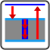
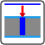

# ПРОШИВНЫЕ ОПЕРАЦИЙ
TODO: вступление


## ОПИСАНИЕ ФУНКЦИЙ ДОСТУПНЫХ ЧЕРЕЗ ИНТЕРФЕЙС
На экране **F5** доступны основные прошивные циклы:

*  Полный цикл прошивки. КАСАНИЕ+ПРОШИВКА+ВОЗВРАТ. Направление прошивки берётся из 
  вектора перемещения. Если поле **Глубина прошивки** не нулевое, то глубина берётся из него, иначе из вектора.

*  Касание заготовки и отскок для включения рабочего режима. Инициирует новый цикл прошивки.
*  Непосредственно прошивка отверстия. Может быть вызвана многократно, глубина будет наращиваться.
*  Возврат в начальное положение. Завершает цикл прошивки.

*  Выполнить цилиндрическую или коническую разбивку отверстия. Может быть вызвана после поиска касания или 
  непосредственно из текущего места. Дополнительные параметры обработки:
	* F6->ПРОШИВКА->Диаметр начального отверстия [мм]
	* F6->ПРОШИВКА->Диаметр конечного отверстия [мм]
	* F6->ПРОШИВКА->Диаметр электрода [мм]
	* F6->ПРОШИВКА->Плотность электрода [0-1] (1=Цельный электрод)
	* F6->ПРОШИВКА->Высота слоя [мм]


## ПАРАМЕТРЫ ПРОШИВКИ (**F6->ПРОШИВКА**)

Процесс прошивки настраивается с помощью нескольких параметров

| НАЗВАНИЕ                          	| ОПИСАНИЕ                                                           |
|---------------------------------------|--------------------------------------------------------------------|
| Задержка отката в рабочем режиме [мс]	| время игнорирования условий отката, движение останавливается       |
| Величина невозврата из отката [мкм]   | после отката возвращаться с небольшим запасом и начинать обработку |
| Уровень прекращения возврата [1-100]  | уровень ОС при котором откат завершается                           |
| Скорость отката при КЗ [мм/мин]       | скорость размыкания                                                |
| Скорость возврата из отката [мм/мин]  | скорость возврата                                                  |
|---------------------------------------|--------------------------------------------------------------------|
| Расстояние релаксации [мм]            | расстояние на которое отводиться электрод при релаксации           |
| Период релаксации [с]                 | как часто выполнять релаксацию (0 = отключено)                     |
| Расстояние релаксации от начала обработки [нет/да] | точка релаксации относительно текущего положения или начала обработки |
| Скорость релаксации [мм/мин]          | обычно максимально допустимая                                      |
| Останавливать генерацию при релаксации [нет/да] | позволяет добиться более чистой поверхности              |
|---------------------------------------|--------------------------------------------------------------------|
| Опускать ванну автоматически после прошивки |  добавлять команду опускания ванны после окончания прошивки  |
| Отключать прокачку автоматически после прошивки |  добавлять команду отключения прокачки жидкости после окончания прошивки  |
|---------------------------------------|--------------------------------------------------------------------|
| Точка измерения глубины [мм@град]     | полярные координаты точки измерения глубины отверстия, 0 угол вдоль X+, положительный угол против часовой стрелки |
| Доводить глубину отверстия итерационно до заданного значения [нет/да] | если включено, то после каждой итерации происходит замер глубины отверстия и при необходимости запускается новая итерация |

## КОМАНДЫ И ПАРАМЕТРЫ ПОДЧИСТКИ ЭЛЕКТРОДА (**F6->ПОДЧИСТКА**)

При наличии инвертора полярности доступны циклы подчистки электрода

## ОПИСАНИЕ ФУНКЦИЙ ДОСТУПНЫХ ИЗ ПРОГРАММЫ

Координаты задаются в миллиметрах

| НАЗВАНИЕ | ОПИСАНИЕ    | АРГУМЕНТЫ |
|----------|-------------|-----------|
| M100     | полный цикл            | вектор поиска касания, глубина прошивки, отскок |
| M101     | полный цикл с выходом  | вектор поиска касания, глубина прошивки, глубина выхода, скорость выхода |
| M102     | подточить электрод     | глубина подточки |
| M103     | начать цикл. коснуться | вектор поиска касания, отскок |
| M104     | продолжить цикл. прошить | глубина прошивки |
| M105     | завершить цикл. вернуться | нет |
| M109     | печать сообщения          | текст сообщения |
| M110     | коническая разбивка | глубина прошивки, диаметр отверстия (начальный), диаметр электрода, плотность, конечный диаметр отверстия  |
| M116     | измерить глубину |

### Пример вызова фунций из GCOD программы

```

N300 M100(Z-10,5.4)  "прошить по Z на глубину 5.4 мм"
...
N400 M103(Z-10)      "коснуться по Z"
N410 F0.9            "установить скорость 0.9 мм/мин"
N420 M104(5.4)       "прошить на глубину 5.4 мм"
N430 F5              "установить скорость 5 мм/мин"		
N440 M104(1.2)       "прошить выход" 
N450 M105            "возврат"

```


