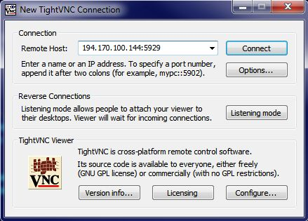

# Система дистанционного управления

Дополнение позволяет запросить подключение к **СЧПУ** оператора из 
сервисного центра, который сможет дистанционно выполнить диагностику 
или настройку системы.

## Установка

1. Скачать [архив](CMD/UPD.VNC.zip) с дополнением.
2. Распаковать в корень USB-Flash диска (файл **update.sh** должен находиться в корне диска).
3. Подключить USB-Flash диск к СЧПУ.
4. Согласиться на установку обновления.
* Перезагрузка не требуется.

## Порядок взаимодействия

* Убедиться в наличии подключения к интернету
* Выполнить запрос в сервисную службу по [телефону](http://edm.ru/contact.html)
* Нажать комбинацию клавиш: **CTRL+ALT+H**

## Дистанционное управление

Возможно активировать дистанционный мониторинг и управление станком.
Для активации выберите в списке программ на USB-Flash диске **enableLVNC**,
перейдите в рабочий режим и выполните выбранную программу. В результате запуститься сервис **VNC**,
который будет запускаться автоматически при каждом включении системы, пока не будет выполнена 
де активация функции с помощью программы **disableLVNC**.  

Сервис **VNC** ожидает входящее подключения на порт **5929**. Если по каким-то причинам нужно изменить номер порта,
это следует сделать перед установкой пакета дистанционного управления в файле **UPD.VNC:VNC/lvnc**.

Если IP адрес станка **194.170.100.144**, то на управляющем терминале нужно ввести следующие параметры подключения:
  
В качестве клиента можно использовать любой **VNCViewer**, например [TightVNC](https://www.tightvnc.com/download.php)

